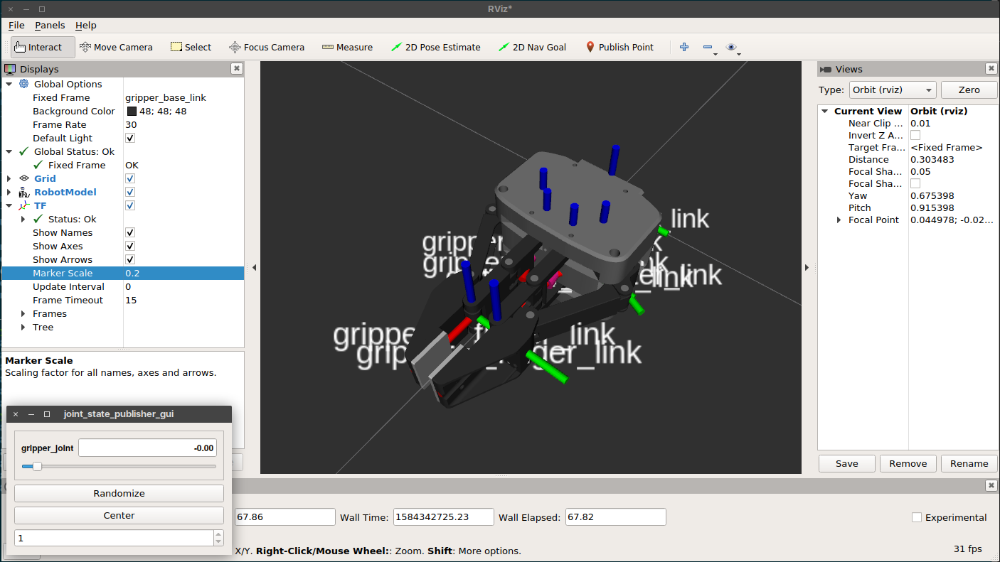
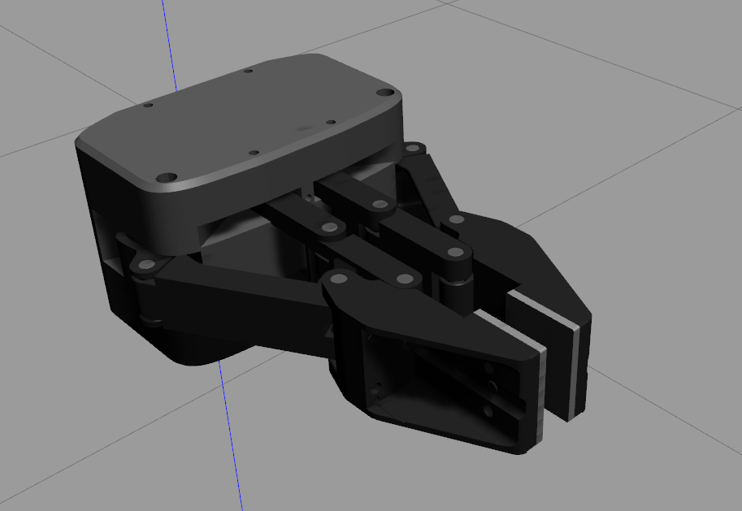
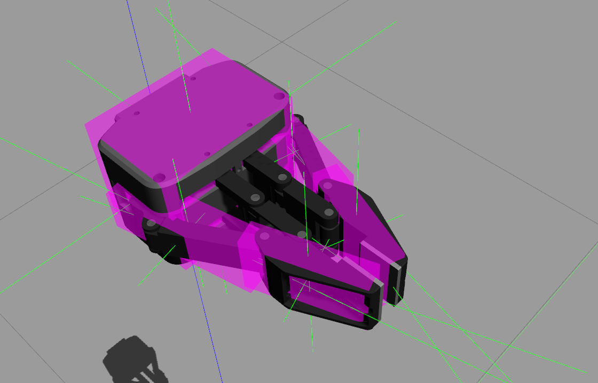
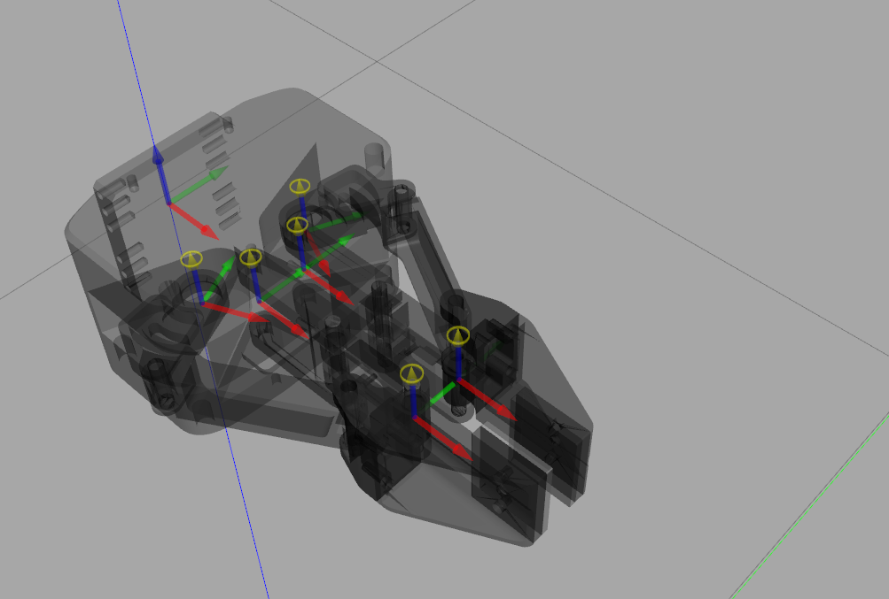
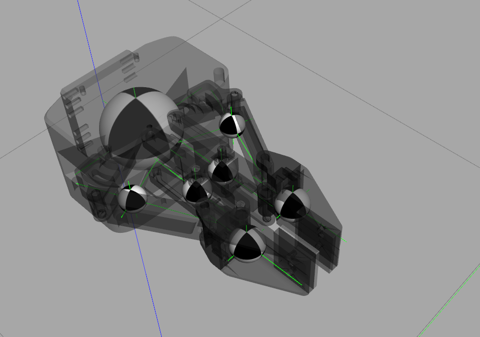

# robotis_gripper
ROS package for simulation of Robotis Gripper RH-P12-RN

# Modelding

Rviz

Gazebo

Inertia of moments

Joints

Center of mass

# Installation

    $ cd ~/catkin_ws/src
    $ git clone https://github.com/byeongkyu/robotis_gripper.git

## Dependencies

    $ git clone https://github.com/byeongkyu/gazebo_mimic_joint_plugin.git
    $ rosdep install --from-paths . --ignore-src -r -y
    $ catkin build

## Usage

### To view using rviz

    $ roslaunch robotis_gripper_description view_robotis_gipper.launch
    $ rviz

### To use Gazebo

    $ roslaunch robotis_gripper_gazebo bringup.launch
    $ roslaunch robotis_gripper_control bringup.launch

### To control the gripper

    $ rostopic pub -1 /gripper_controller/command std_msgs/Float64 "data: 0.0"

Control range is from -0.07 to 1.2